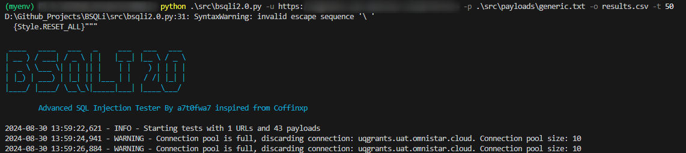
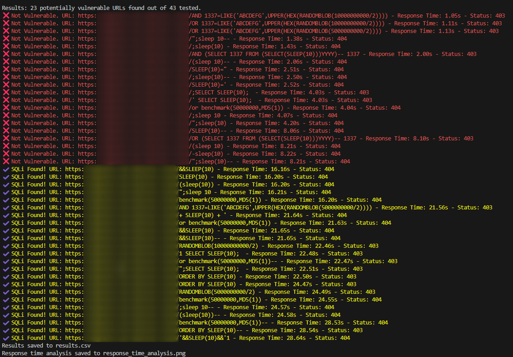

# BSQLi 2.0 - Advanced SQL Injection Tester

BSQLi 2.0 is an advanced SQL injection testing tool inspired by Coffinxp and developed by yours truly a7t0fwa7. This tool is designed to help identify potential SQL injection vulnerabilities in web applications.






## Table of Contents

- [BSQLi 2.0 - Advanced SQL Injection Tester](#bsqli-20---advanced-sql-injection-tester)
  - [Table of Contents](#table-of-contents)
  - [What is SQL Injection?](#what-is-sql-injection)
  - [Installation](#installation)
  - [Prerequisites](#prerequisites)
  - [Features](#features)
  - [Basic Usage](#basic-usage)
  - [Advanced Usage](#advanced-usage)
  - [Options Explained](#options-explained)
  - [Understanding the Output](#understanding-the-output)
  - [Safety and Legal Considerations](#safety-and-legal-considerations)

## What is SQL Injection?

SQL Injection is a code injection technique that exploits vulnerabilities in web applications' database queries. Attackers can potentially manipulate or retrieve data from the database, bypass authentication, or execute administrative operations on the database.

## Installation

1. Ensure you have Python 3.6 or higher installed. You can download it from [python.org](https://www.python.org/downloads/).
2. Open a terminal or command prompt and run the following commands:

```

   git clone https://github.com/YourUsername/BSQLi.git
   cd BSQLi
   pip install -r requirements.txt

```

   This will download the tool and install all necessary dependencies.

## Prerequisites

The following Python libraries are required (they will be installed automatically if you follow the installation steps):

- requests
- colorama
- beautifulsoup4
- matplotlib
- scikit-learn
- numpy

## Features

- Tests multiple URLs for SQL injection vulnerabilities
- Supports custom payloads and automatic payload generation
- Crawls websites to discover additional URLs
- Multi-threaded for faster execution
- Analyzes response times to detect time-based SQL injections
- Saves results in CSV or JSON format
- Can store results in an SQLite database
- Supports proxy usage for anonymity
- Allows custom User-Agent strings
- Provides detailed logging and verbose output options
- Uses K-means clustering for advanced response time analysis
- Generates visualizations of response time data

## Basic Usage

To test a single URL for SQL injection vulnerabilities:

```

python bsqli2.0.py -u "http://example.com/page.php?id=1" -p payloads.txt

```

This command will test the URL "http://example.com/page.php?id=1" using payloads from the file "payloads.txt".

## Advanced Usage

1. Test multiple URLs from a file, using automatic payload generation:

```

   python bsqli2.0.py -l urls.txt --generate-payloads -o results.csv

```

   This will test all URLs listed in "urls.txt", automatically generate payloads, and save the results to "results.csv".

2. Crawl a website and test discovered URLs:

```

   python bsqli2.0.py -u "http://example.com" --crawl -p payloads.txt -o results.json

```

   This command will crawl "http://example.com", test all discovered URLs using payloads from "payloads.txt", and save results to "results.json".

3. Use a proxy and custom User-Agent:

```

   python bsqli2.0.py -u "http://example.com/page.php?id=1" -p payloads.txt -x "http://127.0.0.1:8080" -ua "Mozilla/5.0"

```

   This will route requests through the specified proxy and use the provided User-Agent string.

4. Enable verbose output and use SQLite database storage:

```

   python bsqli2.0.py -u "http://example.com/page.php?id=1" -p payloads.txt -v --use-db

```

   This command enables detailed logging and stores results in an SQLite database.

5. Use multiple threads and set a custom timeout:

```

   python bsqli2.0.py -u "http://example.com/page.php?id=1" -p payloads.txt -t 50 -T 15

```

   This uses 50 concurrent threads and sets a 15-second timeout for each request.

## Options Explained

- `-u, --url`: The target URL to test
- `-l, --list`: A file containing multiple URLs to test
- `-p, --payloads`: A file containing SQL injection payloads
- `-c, --cookie`: Specify a cookie to include in requests
- `-t, --threads`: Number of concurrent threads (default: 40)
- `-T, --timeout`: Timeout for each request in seconds (default: 30)
- `-o, --output`: File to save results (CSV or JSON format)
- `-ua, --user-agent`: Custom User-Agent string
- `-x, --proxy`: Proxy server to use (e.g., "http://127.0.0.1:8080")
- `-d, --delay`: Random delay between requests (in seconds)
- `-v, --verbose`: Enable detailed logging
- `--crawl`: Crawl the website to find more URLs
- `--generate-payloads`: Automatically generate SQL injection payloads
- `--use-db`: Store results in an SQLite database

## Understanding the Output

1. Console Output:

   - Shows real-time progress of the testing
   - Displays summary of potentially vulnerable URLs
2. File Output (CSV or JSON):

   - Contains detailed information about each tested URL
   - Includes vulnerability status, response time, and status code
3. Database Output (SQLite):

   - Stores all test results for later analysis
   - Useful for large-scale testing and long-term data storage
4. Visualization:

   - Generates a PNG image showing response time clustering
   - Helps identify anomalies that might indicate vulnerabilities

## Safety and Legal Considerations

- Only use this tool on websites you own or have explicit permission to test
- Unauthorized testing of websites may be illegal and is not condoned
- The developers are not responsible for any misuse or damage caused by this tool
- Always respect the law and ethical guidelines in your jurisdiction

Remember: With great power comes great responsibility. Use this tool wisely and ethically.
